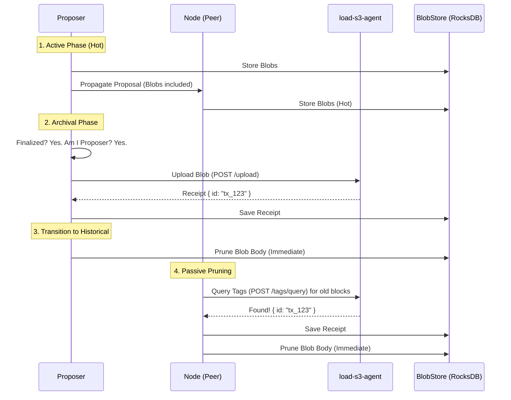

# Phase 6: V0 Async Archival & Pruning Design

**Status**: Final V0 (Ephemeral Chain Model)
**Target**: V0 Implementation
**Context**: Ultramarine Consensus + `load-s3-agent`

## 1. Overview

This document outlines the V0 design for the **Asynchronous Archival and Pruning** subsystem in Ultramarine.

**Core Philosophy**:
1.  **Consensus First**: Block production is decoupled from archival. Blobs are initially stored in "Hot Storage" (RocksDB).
2.  **Proposer Obligation**: The successful proposer of a finalized block is responsible for archiving it to `load-s3-agent`.
3.  **Ephemeral Data Availability**: The consensus chain strictly guarantees availability only for **active (not yet archived)** blobs. Once a blob is archived, it is considered "Historical Data" and is **removed from the active chain state**.
4.  **Receipt-Based Sync**: Nodes synchronizing historical blocks do **not** download archived blob bodies. They verify the consensus (headers/signatures) and accept the "Archive Receipt" as proof of history.

---

## 2. Architecture

The lifecycle defines a strict transition from "Hot/Active" to "Cold/Historical".



---

## 3. Data Structures

### 3.1 `ArchiveReceipt`
The proof returned by the storage provider.

```rust
#[derive(Clone, Debug, Serialize, Deserialize, PartialEq, Eq, Ssz)]
pub struct ArchiveReceipt {
    /// Unique identifier from provider (e.g., Arweave TX ID / DataItem ID)
    pub storage_id: String,
    pub provider_id: String, // "load-s3-agent"
}
```

### 3.2 `SyncedValuePackage` Update
The sync protocol is updated to reflect the "Ephemeral" model. A package can contain receipts *instead* of blobs.

```rust
pub enum SyncedValuePackage {
    /// Active Block: Blobs are hot and provided.
    Full {
        value: Value,
        execution_payload_ssz: Bytes,
        blob_sidecars: Vec<BlobSidecar>, 
        execution_requests: Vec<Bytes>,
    },
    
    /// Historical Block: Blobs are archived.
    /// Syncing nodes accept this as valid without downloading blobs.
    Archived {
        value: Value,
        execution_payload_ssz: Bytes,
        archive_receipts: Vec<Option<ArchiveReceipt>>, // Proof of history
        execution_requests: Vec<Bytes>,
    },
}
```

---

## 4. Component Design

### 4.1 `ArchiverService` (Background Task)
Runs in `ultramarine-node`.

**Loop 1: Archival (Proposer Duty)**
*   Polls `store` for decided blocks without receipts where `self.address == proposer`.
*   **Action**: Uploads blobs to `load-s3-agent`.
*   **On Success**: Saves `ArchiveReceipt` to `BlobMetadata` and **immediately calls `store.prune_blob_body(height)`**.

**Loop 2: Verification (Network Duty)**
*   Polls `store` for decided blocks without receipts where `blobs` are still present.
*   **Action**: Queries `load-s3-agent` for tags.
*   **On Found**: Saves `ArchiveReceipt` and **immediately calls `store.prune_blob_body(height)`**.

### 4.2 `BlobEngine` Updates
*   **`prune_blob_body(height)`**: Deletes the ~128KB blob data but **keeps the KZG Commitment and ArchiveReceipt**.
*   **`get_for_import`**: If pruned, returns empty/error (EL must handle missing blobs for historical blocks gracefully).

### 4.3 Sync Logic (`app.rs`)
*   **Serving Sync**:
    *   If `BlobMetadata` has receipts -> Send `SyncedValuePackage::Archived`.
    *   If `BlobMetadata` has blobs -> Send `SyncedValuePackage::Full`.
*   **Consuming Sync**:
    *   If `Archived`: Verify `Value` (signatures/headers). Store `execution_payload` and `receipts`. **Skip Blob Verification**. (Trusting the "Weak Subjectivity" of the receipts + finalized chain).
    *   If `Full`: Verify Blobs (KZG) and Store.

---

## 5. Implications & Theory

### 5.1 "Not Part of the Chain"
By treating archived blobs as historical, we align with the **EIP-4844** philosophy where blobs are ephemeral.
*   **Validation**: A new node verifies the *chain of headers* and *consensus signatures*. It does not verify the availability of data for blocks that are already finalized and archived.
*   **Availability**: Data availability is guaranteed by the `load-s3-agent` (Oracle) and the receipts stored in the chain metadata.

### 5.2 Pruning Strategy
*   **Trigger**: Receipt existence.
*   **Window**: **Zero**. As soon as a node confirms the blob is safe in the Archive, it deletes the local copy.
*   **Motivation**: Proposers free disk space immediately. Peers free disk space as soon as they verify the Proposer's work.

---

## 6. Implementation Plan (V0)

1.  **Types**: Add `ArchiveReceipt` and `SyncedValuePackage::Archived` to `ultramarine-types`.
2.  **Store**: Add `update_blob_metadata_receipts` to `Store`.
3.  **Engine**: Add `prune_blob_body` (soft delete data, keep metadata) to `BlobEngine`.
4.  **Client**: Implement `ArchiverClient` (reqwest).
5.  **Service**: Implement `ArchiverService` with the "Upload & Prune" loop.
6.  **Sync**: Update `app.rs` to handle `Archived` packages (skip KZG check, just store payload).

---

**Summary**: This design minimizes validator storage footprint and P2P bandwidth. Only "live" blobs transit the P2P network. Historical data is offloaded to the Archive, referenced only by on-chain receipts.